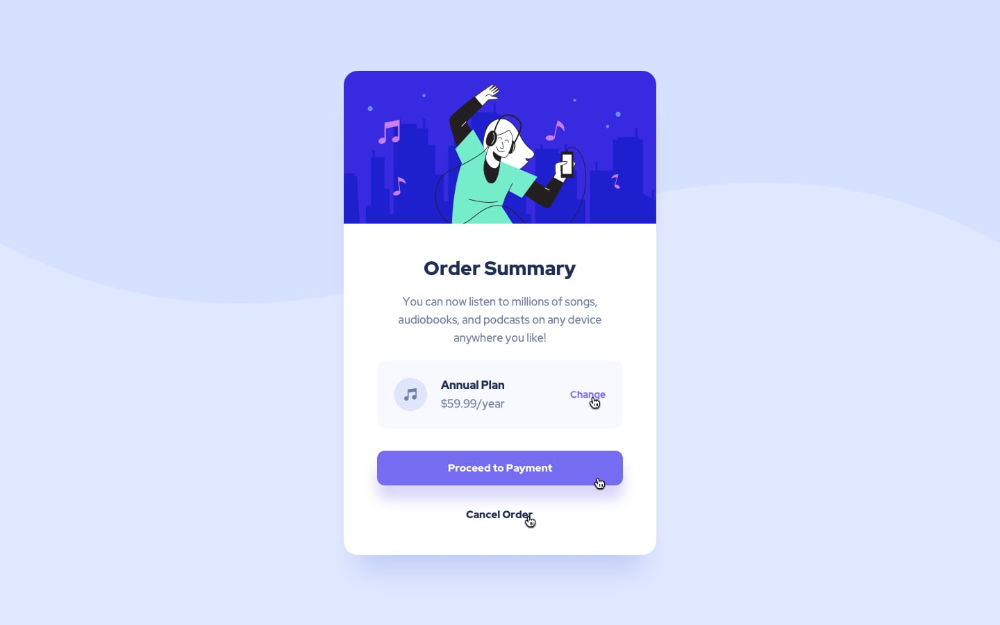

# Frontend Mentor - Order summary card
**To do this challenge, you need a basic understanding of HTML and CSS.**

## The challenge

Your challenge is to build out this order summary card component and get it looking as close to the design as possible.

You can use any tools you like to help you complete the challenge. So if you've got something you'd like to practice, feel free to give it a go.

Following are the Styles required for task
# Front-end Style Guide

## Layout

The designs were created to the following widths:

- Mobile: 375px
- Desktop: 1440px

## Colors

### Primary

- Pale blue:  #e0e8ff
- Bright blue: #3829e0

### Neutral

- Very pale blue: #f5f7ff
- Desaturated blue: #7280a7
- Dark blue:  #1f2f56

## Typography

### Body Copy

- Font size (paragraph): 16px

### Font

- Family: [Red Hat Display](https://fonts.google.com/specimen/Red+Hat+Display)
- Weights: 500, 700, 900

## Sample Images
### Mobile Version

### Desktop Version

### Active States Version
